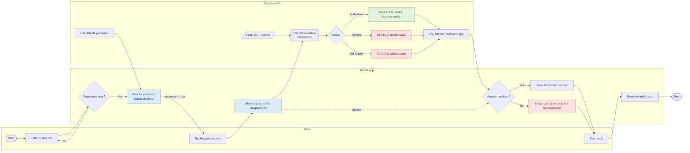

```mermaid
flowchart LR
    subgraph L1["User"]
        S([Start]) --> ID[Enter ID and PIN]
        TAP[Tap Request access]
        SEE[See result]
    end

    subgraph L2["Mobile app"]
        REG{Registered user?}
        WAIT[Wait for presence<br/>button disabled]
        SEND[Send request to the Raspberry Pi]
        NET{Answer received?}
        SHOW[Show authorized / denied]
        TECH[Show: operation could not be completed]
        RST[Return to initial state]
    end

    subgraph L3["Raspberry Pi"]
        PIR[PIR detects presence]
        VAL[[Shared validation<br/>validator.py]]
        RES{Result}
        OK[Green LED, motor, success audio]
        NO[Red LED, denial audio]
        ERR[Red blink, failure audio]
        LOG[Log attempt, method = app]
        OTHER[/Face, GUI, buttons/] -.-> VAL
    end

    ID --> REG
    REG -- No --> ID
    REG -- Yes --> WAIT
    PIR --> WAIT
    WAIT -->|presence = true| TAP
    TAP --> SEND --> VAL --> RES
    RES -- Authorized --> OK --> LOG
    RES -- Denied --> NO --> LOG
    RES -- DB failure --> ERR --> LOG
    LOG --> NET
    SEND -.->|timeout| NET
    NET -- Yes --> SHOW --> SEE
    NET -- No --> TECH --> SEE
    SEE --> RST --> E([End])

    classDef ok fill:#E4F3DE,stroke:#548235,color:#375623;
    classDef bad fill:#FBE2E1,stroke:#C0504D,color:#7A2E2C;
    classDef app fill:#DDEBF7,stroke:#1F4E79,color:#1F3864;
    class OK ok;
    class NO,ERR,TECH bad;
    class SEND,WAIT app;
```