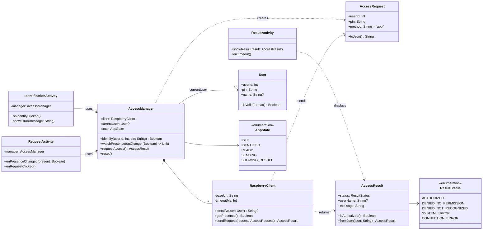

```mermaid
classDiagram
    direction LR

    class IdentificationActivity {
        -manager: AccessManager
        +onIdentifyClicked()
        +showError(message: String)
    }
    class RequestActivity {
        -manager: AccessManager
        +onPresenceChanged(present: Boolean)
        +onRequestClicked()
    }
    class ResultActivity {
        +showResult(result: AccessResult)
        +onTimeout()
    }

    class AccessManager {
        -client: RaspberryClient
        -currentUser: User?
        -state: AppState
        +identify(userId: Int, pin: String) Boolean
        +watchPresence(onChange: (Boolean) -> Unit)
        +requestAccess() AccessResult
        +reset()
    }

    class RaspberryClient {
        -baseUrl: String
        -timeoutMs: Int
        +identify(user: User) String?
        +getPresence() Boolean
        +sendRequest(request: AccessRequest) AccessResult
    }

    class User {
        +userId: Int
        -pin: String
        +name: String?
        +isValidFormat() Boolean
    }

    class AccessRequest {
        +userId: Int
        +pin: String
        +method: String = "app"
        +toJson() String
    }

    class AccessResult {
        +status: ResultStatus
        +userName: String?
        +message: String
        +isAuthorized() Boolean
        +fromJson(json: String)$ AccessResult
    }

    class ResultStatus {
        <<enumeration>>
        AUTHORIZED
        DENIED_NO_PERMISSION
        DENIED_NOT_RECOGNIZED
        SYSTEM_ERROR
        CONNECTION_ERROR
    }

    class AppState {
        <<enumeration>>
        IDLE
        IDENTIFIED
        READY
        SENDING
        SHOWING_RESULT
    }

    IdentificationActivity --> AccessManager : uses
    RequestActivity --> AccessManager : uses
    ResultActivity ..> AccessResult : displays

    AccessManager "1" *-- "1" RaspberryClient
    AccessManager "1" --> "0..1" User : currentUser
    AccessManager --> AppState
    AccessManager ..> AccessRequest : creates

    RaspberryClient ..> AccessRequest : sends
    RaspberryClient ..> AccessResult : returns
    AccessResult --> ResultStatus
```