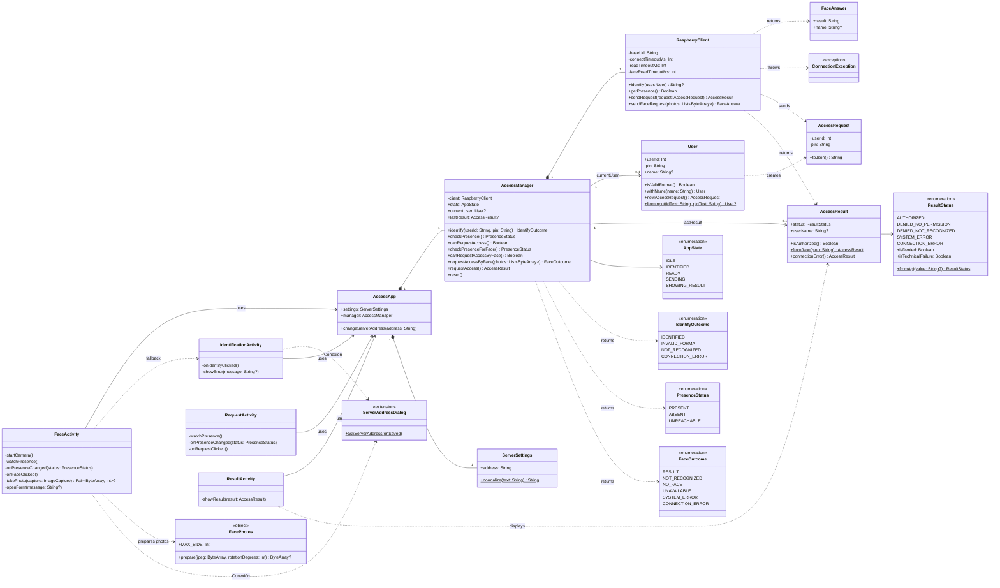

```mermaid
classDiagram
    direction LR

    class FaceActivity {
        -startCamera()
        -watchPresence()
        -onPresenceChanged(status: PresenceStatus)
        -onFaceClicked()
        -takePhoto(capture: ImageCapture) Pair~ByteArray, Int~?
        -openForm(message: String?)
    }
    class IdentificationActivity {
        -onIdentifyClicked()
        -showError(message: String?)
    }
    class ServerAddressDialog {
        <<extension>>
        +askServerAddress(onSaved)$
    }
    class FacePhotos {
        <<object>>
        +MAX_SIDE: Int
        +prepare(jpeg: ByteArray, rotationDegrees: Int)$ ByteArray?
    }
    class RequestActivity {
        -watchPresence()
        -onPresenceChanged(status: PresenceStatus)
        -onRequestClicked()
    }
    class ResultActivity {
        -showResult(result: AccessResult)
    }

    class AccessApp {
        +settings: ServerSettings
        +manager: AccessManager
        +changeServerAddress(address: String)
    }

    class ServerSettings {
        +address: String
        +normalize(text: String)$ String
    }

    class AccessManager {
        -client: RaspberryClient
        +state: AppState
        +currentUser: User?
        +lastResult: AccessResult?
        +identify(userId: String, pin: String) IdentifyOutcome
        +checkPresence() PresenceStatus
        +canRequestAccess() Boolean
        +checkPresenceForFace() PresenceStatus
        +canRequestAccessByFace() Boolean
        +requestAccessByFace(photos: List~ByteArray~) FaceOutcome
        +requestAccess() AccessResult
        +reset()
    }

    class RaspberryClient {
        -baseUrl: String
        -connectTimeoutMs: Int
        -readTimeoutMs: Int
        -faceReadTimeoutMs: Int
        +identify(user: User) String?
        +getPresence() Boolean
        +sendRequest(request: AccessRequest) AccessResult
        +sendFaceRequest(photos: List~ByteArray~) FaceAnswer
    }

    class FaceAnswer {
        +result: String
        +name: String?
    }

    class ConnectionException {
        <<exception>>
    }

    class User {
        +userId: Int
        -pin: String
        +name: String?
        +isValidFormat() Boolean
        +withName(name: String) User
        +newAccessRequest() AccessRequest
        +fromInput(idText: String, pinText: String)$ User?
    }

    class AccessRequest {
        +userId: Int
        -pin: String
        +toJson() String
    }

    class AccessResult {
        +status: ResultStatus
        +userName: String?
        +isAuthorized() Boolean
        +fromJson(json: String)$ AccessResult
        +connectionError()$ AccessResult
    }

    class ResultStatus {
        <<enumeration>>
        AUTHORIZED
        DENIED_NO_PERMISSION
        DENIED_NOT_RECOGNIZED
        SYSTEM_ERROR
        CONNECTION_ERROR
        +isDenied: Boolean
        +isTechnicalFailure: Boolean
        +fromApi(value: String?)$ ResultStatus
    }

    class AppState {
        <<enumeration>>
        IDLE
        IDENTIFIED
        READY
        SENDING
        SHOWING_RESULT
    }

    class IdentifyOutcome {
        <<enumeration>>
        IDENTIFIED
        INVALID_FORMAT
        NOT_RECOGNIZED
        CONNECTION_ERROR
    }

    class PresenceStatus {
        <<enumeration>>
        PRESENT
        ABSENT
        UNREACHABLE
    }

    class FaceOutcome {
        <<enumeration>>
        RESULT
        NOT_RECOGNIZED
        NO_FACE
        UNAVAILABLE
        SYSTEM_ERROR
        CONNECTION_ERROR
    }

    FaceActivity --> AccessApp : uses
    FaceActivity ..> IdentificationActivity : fallback
    FaceActivity ..> FacePhotos : prepares photos
    FaceActivity ..> ServerAddressDialog : Conexión
    IdentificationActivity ..> ServerAddressDialog : Conexión
    IdentificationActivity --> AccessApp : uses
    RequestActivity --> AccessApp : uses
    ResultActivity --> AccessApp : uses
    ResultActivity ..> AccessResult : displays

    AccessApp "1" *-- "1" AccessManager
    AccessApp "1" *-- "1" ServerSettings

    AccessManager "1" *-- "1" RaspberryClient
    RaspberryClient ..> FaceAnswer : returns
    RaspberryClient ..> ConnectionException : throws
    AccessManager "1" --> "0..1" User : currentUser
    AccessManager "1" --> "0..1" AccessResult : lastResult
    AccessManager --> AppState
    AccessManager ..> IdentifyOutcome : returns
    AccessManager ..> PresenceStatus : returns
    AccessManager ..> FaceOutcome : returns

    User ..> AccessRequest : creates
    RaspberryClient ..> AccessRequest : sends
    RaspberryClient ..> AccessResult : returns
    AccessResult --> ResultStatus
```
