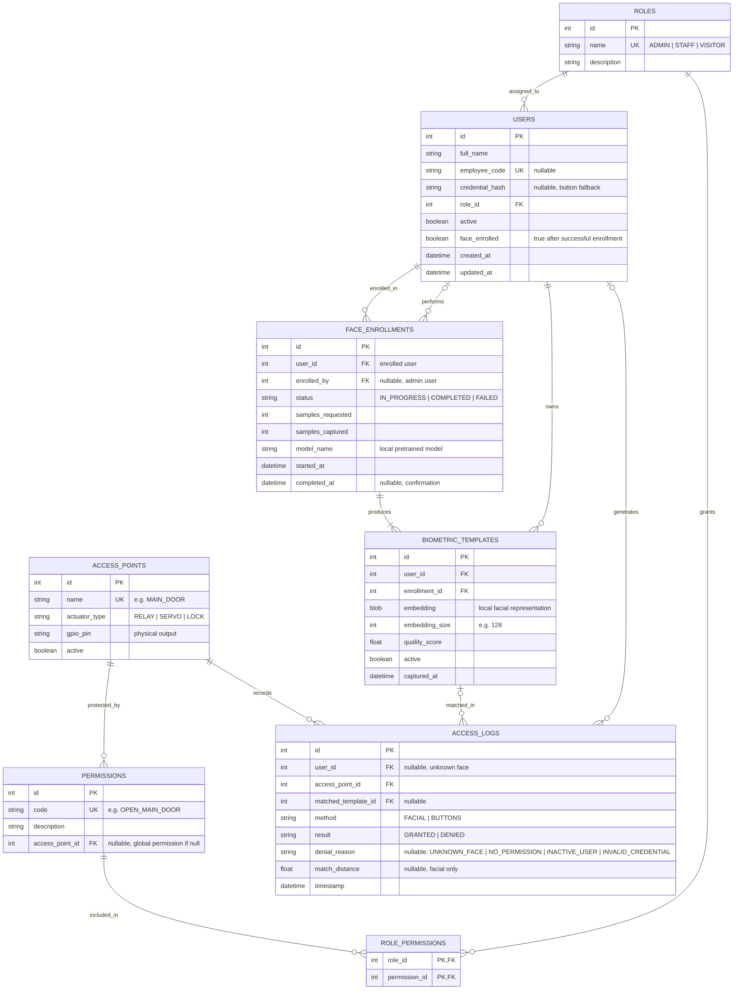

```mermaid
erDiagram
    ROLES ||--o{ USERS : assigned_to
    ROLES ||--o{ ROLE_PERMISSIONS : grants
    PERMISSIONS ||--o{ ROLE_PERMISSIONS : included_in
    ACCESS_POINTS ||--o{ PERMISSIONS : protected_by
    USERS ||--o{ FACE_ENROLLMENTS : enrolled_in
    USERS |o--o{ FACE_ENROLLMENTS : performs
    FACE_ENROLLMENTS ||--|{ BIOMETRIC_TEMPLATES : produces
    USERS ||--o{ BIOMETRIC_TEMPLATES : owns
    USERS |o--o{ ACCESS_LOGS : generates
    ACCESS_POINTS ||--o{ ACCESS_LOGS : records
    BIOMETRIC_TEMPLATES |o--o{ ACCESS_LOGS : matched_in

    ROLES {
        int id PK
        string name UK "ADMIN | STAFF | VISITOR"
        string description
    }

    PERMISSIONS {
        int id PK
        string code UK "e.g. OPEN_MAIN_DOOR"
        string description
        int access_point_id FK "nullable, global permission if null"
    }

    ROLE_PERMISSIONS {
        int role_id PK, FK
        int permission_id PK, FK
    }

    ACCESS_POINTS {
        int id PK
        string name UK "e.g. MAIN_DOOR"
        string actuator_type "RELAY | SERVO | LOCK"
        string gpio_pin "physical output"
        boolean active
    }

    USERS {
        int id PK
        string full_name
        string employee_code UK "nullable"
        string credential_hash "nullable, button fallback"
        int role_id FK
        boolean active
        boolean face_enrolled "true after successful enrollment"
        datetime created_at
        datetime updated_at
    }

    FACE_ENROLLMENTS {
        int id PK
        int user_id FK "enrolled user"
        int enrolled_by FK "nullable, admin user"
        string status "IN_PROGRESS | COMPLETED | FAILED"
        int samples_requested
        int samples_captured
        string model_name "local pretrained model"
        datetime started_at
        datetime completed_at "nullable, confirmation"
    }

    BIOMETRIC_TEMPLATES {
        int id PK
        int user_id FK
        int enrollment_id FK
        blob embedding "local facial representation"
        int embedding_size "e.g. 128"
        float quality_score
        boolean active
        datetime captured_at
    }

    ACCESS_LOGS {
        int id PK
        int user_id FK "nullable, unknown face"
        int access_point_id FK
        int matched_template_id FK "nullable"
        string method "FACIAL | BUTTONS"
        string result "GRANTED | DENIED"
        string denial_reason "nullable: UNKNOWN_FACE | NO_PERMISSION | INACTIVE_USER | INVALID_CREDENTIAL"
        float match_distance "nullable, facial only"
        datetime timestamp
    }
```