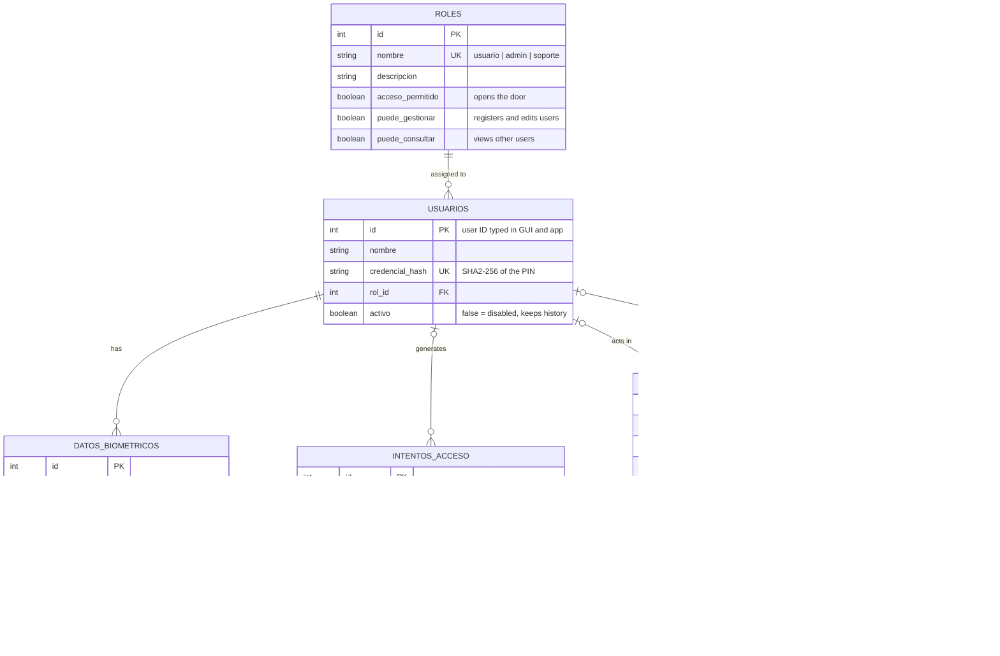

```mermaid
erDiagram
    ROLES ||--o{ USUARIOS : "assigned to"
    USUARIOS ||--o{ DATOS_BIOMETRICOS : "has"
    USUARIOS |o--o{ INTENTOS_ACCESO : "generates"
    USUARIOS |o--o{ EVENTOS : "acts in"
    USUARIOS |o--o{ EVENTOS : "affected by"

    ROLES {
        int id PK
        string nombre UK "usuario | admin | soporte"
        string descripcion
        boolean acceso_permitido "opens the door"
        boolean puede_gestionar "registers and edits users"
        boolean puede_consultar "views other users"
    }

    USUARIOS {
        int id PK "user ID typed in GUI and app"
        string nombre
        string credencial_hash UK "SHA2-256 of the PIN"
        int rol_id FK
        boolean activo "false = disabled, keeps history"
    }

    DATOS_BIOMETRICOS {
        int id PK
        int usuario_id FK "ON DELETE CASCADE"
        string tipo "facial"
        blob embedding "template only, no images"
        string modelo
        datetime fecha_registro
    }

    INTENTOS_ACCESO {
        int id PK
        int usuario_id FK "NULL if nobody identified"
        string metodo "facial | gui | botones | app | app_facial"
        string resultado "autorizado | denegado_* | error_sistema"
        datetime fecha_hora
    }

    EVENTOS {
        int id PK
        string evento_uid UK "a retry never stores it twice"
        datetime fecha_hora "when it happened"
        datetime recibido "when it was stored"
        string tipo "acceso | identificacion | admin_* | alta_usuario | cambio_rol | ..."
        string origen "gui | botones | facial | app | app_facial | sistema"
        int usuario_id FK "who acted, ON DELETE SET NULL"
        int afectado_id FK "who was affected, ON DELETE SET NULL"
        string resultado
        string detalle "never a key"
        boolean sin_conexion "recorded by the phone offline (FR-25)"
        string dispositivo "address of the phone"
    }
```