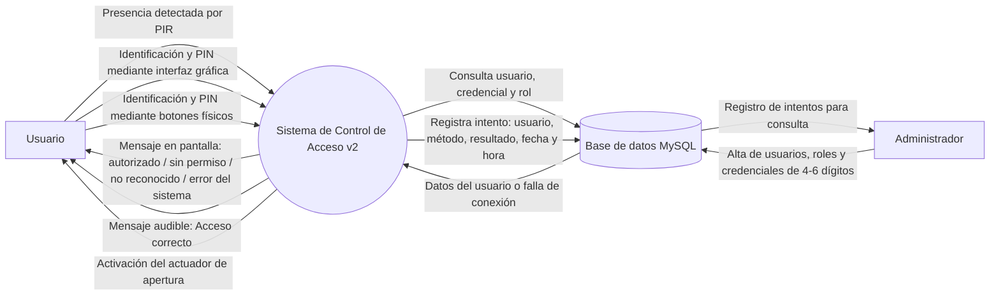

```mermaid
flowchart LR
    U[Usuario]
    A[Administrador]
    DB[(Base de datos MySQL)]
    S((Sistema de Control de Acceso v2))

    U -->|Presencia detectada por PIR| S
    U -->|Identificación y PIN mediante interfaz gráfica| S
    U -->|Identificación y PIN mediante botones físicos| S

    S -->|Mensaje en pantalla: autorizado / sin permiso / no reconocido / error del sistema| U
    S -->|Mensaje audible: Acceso correcto| U
    S -->|Activación del actuador de apertura| U

    A -->|Alta de usuarios, roles y credenciales de 4-6 dígitos| DB
    DB -->|Registro de intentos para consulta| A

    S -->|Consulta usuario, credencial y rol| DB
    DB -->|Datos del usuario o falla de conexión| S
    S -->|Registra intento: usuario, método, resultado, fecha y hora| DB
```