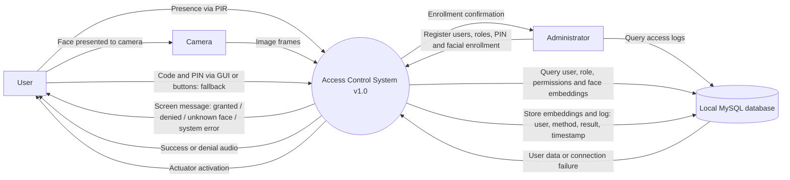

```mermaid
flowchart LR
    U[User]
    A[Administrator]
    CAM[Camera]
    DB[(Local MySQL database)]
    S((Access Control System v1.0))

    U -->|Presence via PIR| S
    U -->|Face presented to camera| CAM
    CAM -->|Image frames| S
    U -->|Code and PIN via GUI or buttons: fallback| S

    S -->|Screen message: granted / denied / unknown face / system error| U
    S -->|Success or denial audio| U
    S -->|Actuator activation| U

    A -->|Register users, roles, PIN and facial enrollment| S
    S -->|Enrollment confirmation| A
    A -->|Query access logs| DB

    S -->|Query user, role, permissions and face embeddings| DB
    DB -->|User data or connection failure| S
    S -->|Store embeddings and log: user, method, result, timestamp| DB
```