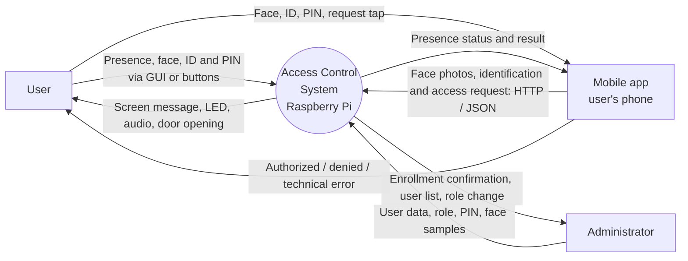

```mermaid
flowchart LR
    U[User]
    APP[Mobile app<br/>user's phone]
    A[Administrator]
    S((Access Control<br/>System<br/>Raspberry Pi))

    U -->|Presence, face, ID and PIN via GUI or buttons| S
    S -->|Screen message, LED, audio, door opening| U

    U -->|Face, ID, PIN, request tap| APP
    APP -->|Face photos, identification and access request: HTTP / JSON| S
    S -->|Presence status and result| APP
    APP -->|Authorized / denied / technical error| U

    A -->|User data, role, PIN, face samples| S
    S -->|Enrollment confirmation, user list, role change| A
```