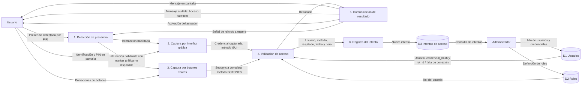

```mermaid
flowchart LR
    U[Usuario]
    A[Administrador]

    P1[1. Detección de presencia]
    P2[2. Captura por interfaz gráfica]
    P3[3. Captura por botones físicos]
    P4[4. Validación de acceso]
    P5[5. Comunicación del resultado]
    P6[6. Registro del intento]

    D1[(D1 Usuarios)]
    D2[(D2 Roles)]
    D3[(D3 Intentos de acceso)]

    U -->|Presencia detectada por PIR| P1
    P1 -->|Interacción habilitada| P2
    P1 -->|Interacción habilitada con interfaz gráfica no disponible| P3

    U -->|Identificación y PIN en pantalla| P2
    U -->|Pulsaciones de botones| P3

    P2 -->|Credencial capturada, método GUI| P4
    P3 -->|Secuencia completa, método BOTONES| P4

    D1 -->|Usuario, credencial_hash y rol_id / falla de conexión| P4
    D2 -->|Rol del usuario| P4

    P4 -->|Resultado| P5
    P4 -->|Usuario, método, resultado, fecha y hora| P6
    P6 -->|Nuevo intento| D3

    P5 -->|Mensaje en pantalla| U
    P5 -->|Mensaje audible: Acceso correcto| U
    P5 -->|Activación del actuador| U
    P5 -->|Señal de reinicio a espera| P1

    A -->|Alta de usuarios y credenciales| D1
    A -->|Definición de roles| D2
    D3 -->|Consulta de intentos| A
```