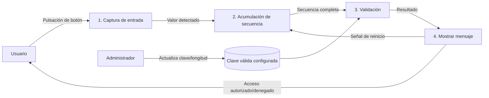

```mermaid
flowchart LR
    U[Usuario] -->|Pulsación de botón| P1[1. Captura de entrada]
    P1 -->|Valor detectado| P2[2. Acumulación de secuencia]
    P2 -->|Secuencia completa| P3[3. Validación]
    D1[(Clave válida configurada)] --> P3
    A[Administrador] -->|Actualiza clave/longitud| D1
    P3 -->|Resultado| P4[4. Mostrar mensaje]
    P4 -->|Acceso autorizado/denegado| U
    P4 -->|Señal de reinicio| P2
```