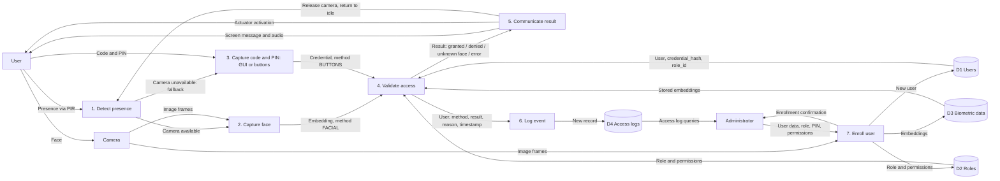

```mermaid
flowchart LR
    U[User]
    A[Administrator]
    CAM[Camera]

    P1[1. Detect presence]
    P2[2. Capture face]
    P3[3. Capture code and PIN: GUI or buttons]
    P4[4. Validate access]
    P5[5. Communicate result]
    P6[6. Log event]
    P7[7. Enroll user]

    D1[(D1 Users)]
    D2[(D2 Roles)]
    D3[(D3 Biometric data)]
    D4[(D4 Access logs)]

    U -->|Presence via PIR| P1
    P1 -->|Camera available| P2
    P1 -->|Camera unavailable: fallback| P3
    U -->|Face| CAM
    CAM -->|Image frames| P2
    CAM -->|Image frames| P7
    U -->|Code and PIN| P3

    P2 -->|Embedding, method FACIAL| P4
    P3 -->|Credential, method BUTTONS| P4
    D3 -->|Stored embeddings| P4
    D1 -->|User, credential_hash, role_id| P4
    D2 -->|Role and permissions| P4

    P4 -->|Result: granted / denied / unknown face / error| P5
    P4 -->|User, method, result, reason, timestamp| P6
    P6 -->|New record| D4

    P5 -->|Screen message and audio| U
    P5 -->|Actuator activation| U
    P5 -->|Release camera, return to idle| P1

    A -->|User data, role, PIN, permissions| P7
    P7 -->|New user| D1
    P7 -->|Embeddings| D3
    P7 -->|Role and permissions| D2
    P7 -->|Enrollment confirmation| A
    D4 -->|Access log queries| A
```