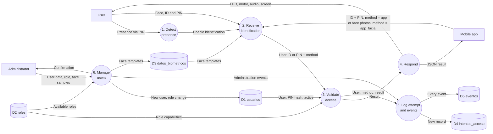

```mermaid
flowchart LR
    U[User]
    APP[Mobile app]
    A[Administrator]

    P1((1. Detect<br/>presence))
    P2((2. Receive<br/>identification))
    P3((3. Validate<br/>access))
    P4((4. Respond))
    P5((5. Log attempt<br/>and events))
    P6((6. Manage<br/>users))

    D1[(D1 usuarios)]
    D2[(D2 roles)]
    D3[(D3 datos_biometricos)]
    D4[(D4 intentos_acceso)]
    D5[(D5 eventos)]

    U -->|Presence via PIR| P1
    P1 -->|Enable identification| P2
    U -->|Face, ID and PIN| P2
    APP -->|ID + PIN, method = app<br/>or face photos, method = app_facial| P2
    D3 -->|Face templates| P2

    P2 -->|User ID or PIN + method| P3
    D1 -->|User, PIN hash, active| P3
    D2 -->|Role capabilities| P3

    P3 -->|Result| P4
    P3 -->|User, method, result| P5
    P5 -->|New record| D4
    P5 -->|Every event| D5

    P4 -->|LED, motor, audio, screen| U
    P4 -->|JSON result| APP

    A -->|User data, role, face samples| P6
    D2 -->|Available roles| P6
    P6 -->|New user, role change| D1
    P6 -->|Administration events| P5
    P6 -->|Face templates| D3
    P6 -->|Confirmation| A
```