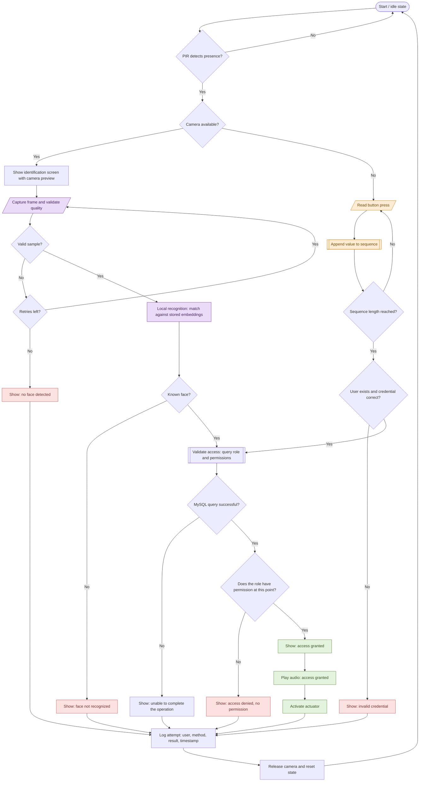

```mermaid
flowchart TD
    A([Start / idle state]) --> B{PIR detects presence?}
    B -- No --> A
    B -- Yes --> C{Camera available?}

    C -- Yes --> D[Show identification screen with camera preview]
    D --> E[/Capture frame and validate quality/]
    E --> F{Valid sample?}
    F -- No --> G{Retries left?}
    G -- Yes --> E
    G -- No --> R5[Show: no face detected]
    F -- Yes --> H[Local recognition: match against stored embeddings]
    H --> I{Known face?}
    I -- No --> R4[Show: face not recognized]
    I -- Yes --> V[[Validate access: query role and permissions]]

    C -- No --> J[/Read button press/]
    J --> K[[Append value to sequence]]
    K --> L{Sequence length reached?}
    L -- No --> J
    L -- Yes --> M{User exists and credential correct?}
    M -- No --> R3[Show: invalid credential]
    M -- Yes --> V

    V --> N{MySQL query successful?}
    N -- No --> R6[Show: unable to complete the operation]
    N -- Yes --> P{Does the role have permission at this point?}
    P -- No --> R2[Show: access denied, no permission]
    P -- Yes --> R1[Show: access granted]

    R1 --> S[Play audio: access granted]
    S --> T[Activate actuator]
    T --> LOG[Log attempt: user, method, result, timestamp]
    R2 --> LOG
    R3 --> LOG
    R4 --> LOG
    R5 --> LOG
    R6 --> LOG

    LOG --> REL[Release camera and reset state]
    REL --> A

    classDef ok fill:#E4F3DE,stroke:#548235,color:#375623;
    classDef bad fill:#FBE2E1,stroke:#C0504D,color:#7A2E2C;
    classDef alt fill:#FDEBD3,stroke:#C87F0A,color:#7A4A05;
    classDef face fill:#EADCF8,stroke:#7030A0,color:#44205F;
    class R1,S,T ok;
    class R2,R3,R4,R5 bad;
    class J,K alt;
    class E,H face;
```
