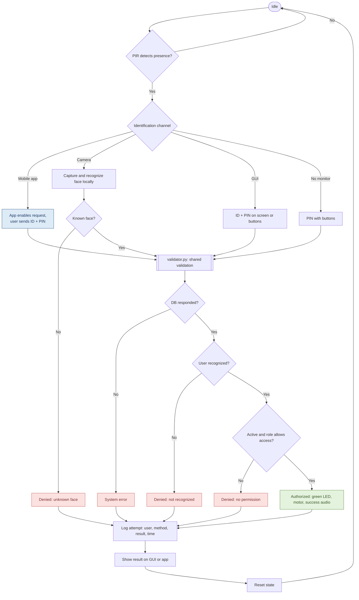

```mermaid
flowchart TD
    A([Idle]) --> B{PIR detects presence?}
    B -- No --> A
    B -- Yes --> C{Identification channel}

    C -- Mobile app --> M[App enables request,<br/>user sends ID + PIN]
    C -- Camera --> F[Capture and recognize face locally]
    C -- GUI --> G[ID + PIN on screen or buttons]
    C -- No monitor --> K[PIN with buttons]

    F --> FK{Known face?}
    FK -- No --> R4[Denied: unknown face]
    FK -- Yes --> V
    M --> V
    G --> V
    K --> V

    V[[validator.py: shared validation]] --> N{DB responded?}
    N -- No --> R5[System error]
    N -- Yes --> UR{User recognized?}
    UR -- No --> R3[Denied: not recognized]
    UR -- Yes --> P{Active and role allows access?}
    P -- No --> R2[Denied: no permission]
    P -- Yes --> R1[Authorized: green LED, motor, success audio]

    R1 & R2 & R3 & R4 & R5 --> LOG[Log attempt: user, method, result, time]
    LOG --> OUT[Show result on GUI or app]
    OUT --> RST[Reset state] --> A

    classDef ok fill:#E4F3DE,stroke:#548235,color:#375623;
    classDef bad fill:#FBE2E1,stroke:#C0504D,color:#7A2E2C;
    classDef app fill:#DDEBF7,stroke:#1F4E79,color:#1F3864;
    class R1 ok;
    class R2,R3,R4,R5 bad;
    class M app;
```
