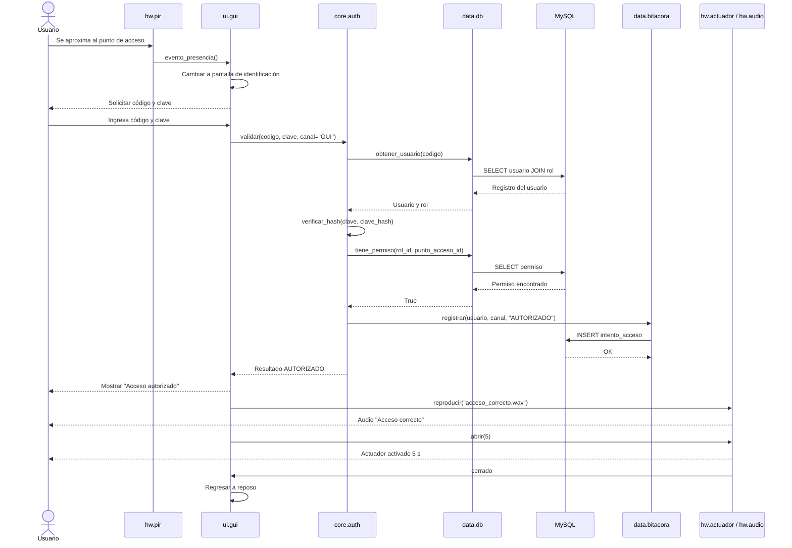

```mermaid
sequenceDiagram
    actor U as Usuario
    participant PIR as hw.pir
    participant GUI as ui.gui
    participant Core as core.auth
    participant DB as data.db
    participant MySQL as MySQL
    participant Log as data.bitacora
    participant HW as hw.actuador / hw.audio

    U->>PIR: Se aproxima al punto de acceso
    PIR->>GUI: evento_presencia()
    GUI->>GUI: Cambiar a pantalla de identificación
    GUI-->>U: Solicitar código y clave

    U->>GUI: Ingresa código y clave
    GUI->>Core: validar(codigo, clave, canal="GUI")

    Core->>DB: obtener_usuario(codigo)
    DB->>MySQL: SELECT usuario JOIN rol
    MySQL-->>DB: Registro del usuario
    DB-->>Core: Usuario y rol

    Core->>Core: verificar_hash(clave, clave_hash)
    Core->>DB: tiene_permiso(rol_id, punto_acceso_id)
    DB->>MySQL: SELECT permiso
    MySQL-->>DB: Permiso encontrado
    DB-->>Core: True

    Core->>Log: registrar(usuario, canal, "AUTORIZADO")
    Log->>MySQL: INSERT intento_acceso
    MySQL-->>Log: OK
    Core-->>GUI: Resultado.AUTORIZADO

    GUI-->>U: Mostrar "Acceso autorizado"
    GUI->>HW: reproducir("acceso_correcto.wav")
    HW-->>U: Audio "Acceso correcto"
    GUI->>HW: abrir(5)
    HW-->>U: Actuador activado 5 s
    HW->>GUI: cerrado
    GUI->>GUI: Regresar a reposo
```