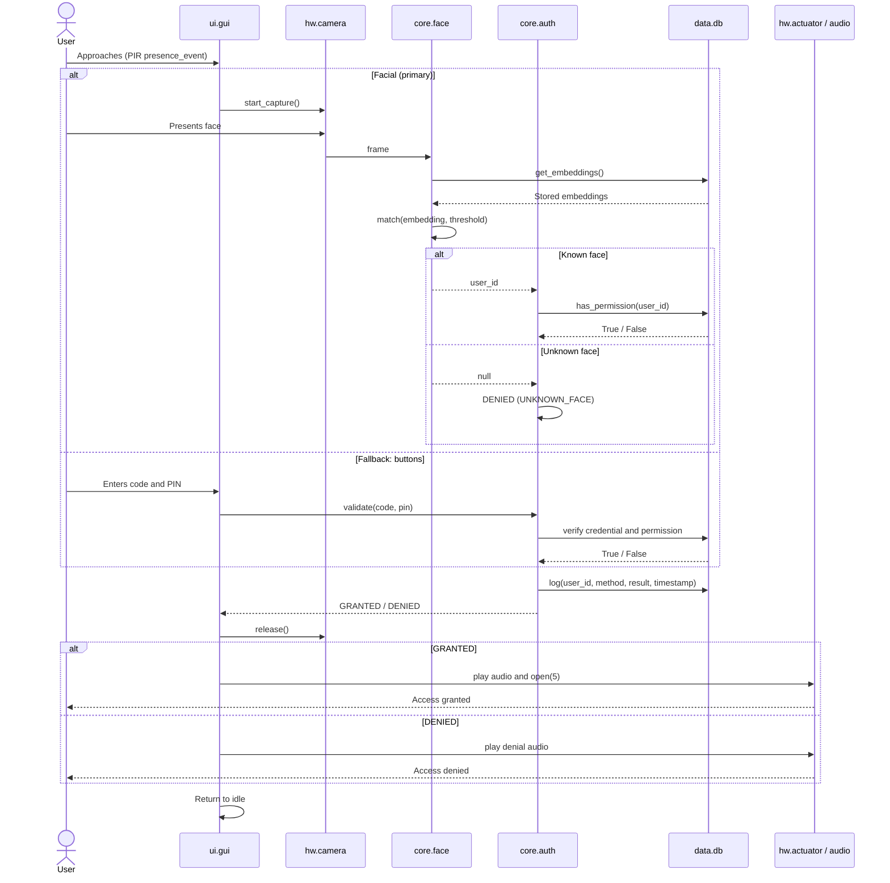

```mermaid
sequenceDiagram
    actor U as User
    participant GUI as ui.gui
    participant CAM as hw.camera
    participant FACE as core.face
    participant Core as core.auth
    participant DB as data.db
    participant HW as hw.actuator / audio

    U->>GUI: Approaches (PIR presence_event)

    alt Facial (primary)
        GUI->>CAM: start_capture()
        U->>CAM: Presents face
        CAM->>FACE: frame
        FACE->>DB: get_embeddings()
        DB-->>FACE: Stored embeddings
        FACE->>FACE: match(embedding, threshold)
        alt Known face
            FACE-->>Core: user_id
            Core->>DB: has_permission(user_id)
            DB-->>Core: True / False
        else Unknown face
            FACE-->>Core: null
            Core->>Core: DENIED (UNKNOWN_FACE)
        end
    else Fallback: buttons
        U->>GUI: Enters code and PIN
        GUI->>Core: validate(code, pin)
        Core->>DB: verify credential and permission
        DB-->>Core: True / False
    end

    Core->>DB: log(user_id, method, result, timestamp)
    Core-->>GUI: GRANTED / DENIED
    GUI->>CAM: release()

    alt GRANTED
        GUI->>HW: play audio and open(5)
        HW-->>U: Access granted
    else DENIED
        GUI->>HW: play denial audio
        HW-->>U: Access denied
    end
    GUI->>GUI: Return to idle
```