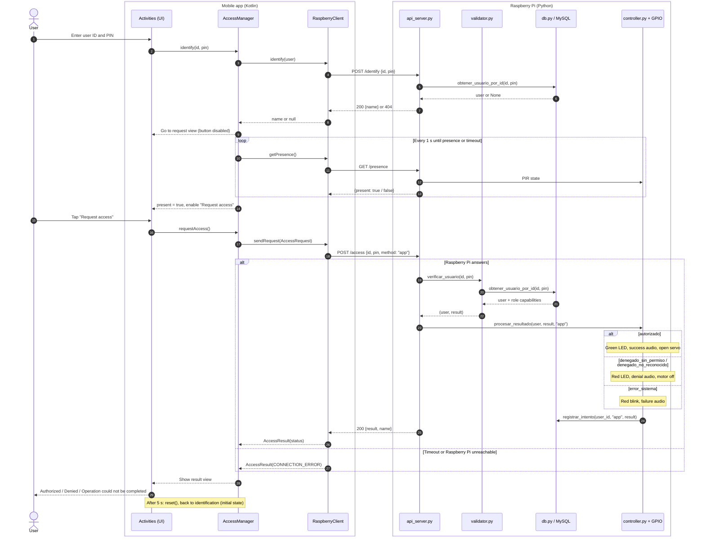

```mermaid
sequenceDiagram
    autonumber
    actor U as User
    box Mobile app (Kotlin)
        participant UI as Activities (UI)
        participant M as AccessManager
        participant C as RaspberryClient
    end
    box Raspberry Pi (Python)
        participant API as api_server.py
        participant V as validator.py
        participant DB as db.py / MySQL
        participant HW as controller.py + GPIO
    end

    U->>UI: Enter user ID and PIN
    UI->>M: identify(id, pin)
    M->>C: identify(user)
    C->>API: POST /identify {id, pin}
    API->>DB: obtener_usuario_por_id(id, pin)
    DB-->>API: user or None
    API-->>C: 200 {name} or 404
    C-->>M: name or null
    M-->>UI: Go to request view (button disabled)

    loop Every 1 s until presence or timeout
        M->>C: getPresence()
        C->>API: GET /presence
        API->>HW: PIR state
        API-->>C: {present: true / false}
    end
    M-->>UI: present = true, enable "Request access"

    U->>UI: Tap "Request access"
    UI->>M: requestAccess()
    M->>C: sendRequest(AccessRequest)
    C->>API: POST /access {id, pin, method: "app"}

    alt Raspberry Pi answers
        API->>V: verificar_usuario(id, pin)
        V->>DB: obtener_usuario_por_id(id, pin)
        DB-->>V: user + role capabilities
        V-->>API: (user, result)
        API->>HW: procesar_resultado(user, result, "app")
        alt autorizado
            Note over HW: Green LED, success audio, open servo
        else denegado_sin_permiso / denegado_no_reconocido
            Note over HW: Red LED, denial audio, motor off
        else error_sistema
            Note over HW: Red blink, failure audio
        end
        HW->>DB: registrar_intento(user_id, "app", result)
        API-->>C: 200 {result, name}
        C-->>M: AccessResult(status)
    else Timeout or Raspberry Pi unreachable
        C-->>M: AccessResult(CONNECTION_ERROR)
    end

    M-->>UI: Show result view
    UI-->>U: Authorized / Denied / Operation could not be completed
    Note over UI,M: After 5 s: reset(), back to identification (initial state)
```