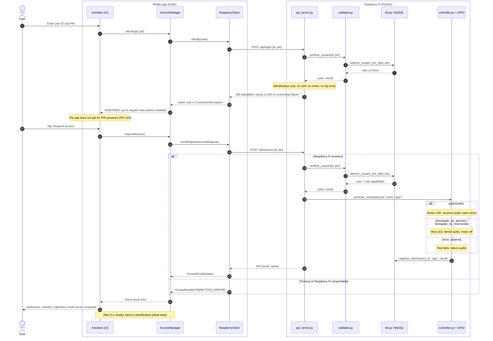

```mermaid
sequenceDiagram
    autonumber
    actor U as User
    box Mobile app (Kotlin)
        participant UI as Activities (UI)
        participant M as AccessManager
        participant C as RaspberryClient
    end
    box Raspberry Pi (Python)
        participant API as api_server.py
        participant V as validator.py
        participant DB as db.py / MySQL
        participant HW as controller.py + GPIO
    end

    U->>UI: Enter user ID and PIN
    UI->>M: identify(id, pin)
    M->>C: identify(user)
    C->>API: POST /api/login {id, pin}
    API->>V: verificar_usuario(id, pin)
    V->>DB: obtener_usuario_por_id(id, pin)
    DB-->>V: user or None
    V-->>API: (user, result)
    Note over API: Identification only: no LED, no motor, no log entry
    API-->>C: 200 {identified, name} or 503 on a technical failure
    C-->>M: name, null, or ConnectionException
    M-->>UI: IDENTIFIED: go to request view (button enabled)
    Note over UI: The app does not ask for PIR presence (PIC-115)

    U->>UI: Tap "Request access"
    UI->>M: requestAccess()
    M->>C: sendRequest(AccessRequest)
    C->>API: POST /api/access {id, pin}

    alt Raspberry Pi answers
        API->>V: verificar_usuario(id, pin)
        V->>DB: obtener_usuario_por_id(id, pin)
        DB-->>V: user + role capabilities
        V-->>API: (user, result)
        API->>HW: procesar_resultado(user, result, "app")
        alt autorizado
            Note over HW: Green LED, success audio, open servo
        else denegado_sin_permiso / denegado_no_reconocido
            Note over HW: Red LED, denial audio, motor off
        else error_sistema
            Note over HW: Red blink, failure audio
        end
        HW->>DB: registrar_intento(user_id, "app", result)
        API-->>C: 200 {result, name}
        C-->>M: AccessResult(status)
    else Timeout or Raspberry Pi unreachable
        C-->>M: AccessResult(CONNECTION_ERROR)
    end

    M-->>UI: Show result view
    UI-->>U: Authorized / Denied / Operation could not be completed
    Note over UI,M: After 8 s: reset(), back to identification (initial state)
```