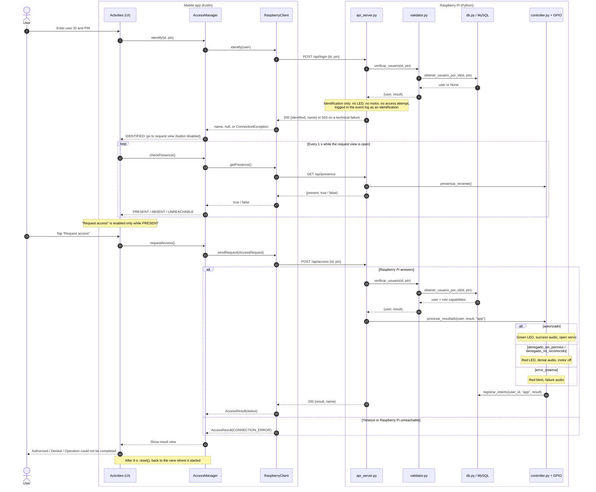
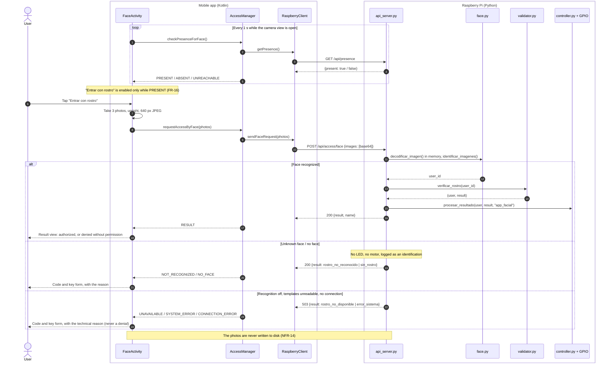

```mermaid
sequenceDiagram
    autonumber
    actor U as User
    box Mobile app (Kotlin)
        participant UI as Activities (UI)
        participant M as AccessManager
        participant C as RaspberryClient
    end
    box Raspberry Pi (Python)
        participant API as api_server.py
        participant V as validator.py
        participant DB as db.py / MySQL
        participant HW as controller.py + GPIO
    end

    U->>UI: Enter user ID and PIN
    UI->>M: identify(id, pin)
    M->>C: identify(user)
    C->>API: POST /api/login {id, pin}
    API->>V: verificar_usuario(id, pin)
    V->>DB: obtener_usuario_por_id(id, pin)
    DB-->>V: user or None
    V-->>API: (user, result)
    Note over API: Identification only: no LED, no motor, no access attempt,<br/>logged in the event log as an identification
    API-->>C: 200 {identified, name} or 503 on a technical failure
    C-->>M: name, null, or ConnectionException
    M-->>UI: IDENTIFIED: go to request view (button disabled)

    loop Every 1 s while the request view is open
        UI->>M: checkPresence()
        M->>C: getPresence()
        C->>API: GET /api/presence
        API->>HW: presencia_reciente()
        API-->>C: {present: true / false}
        C-->>M: true / false
        M-->>UI: PRESENT / ABSENT / UNREACHABLE
    end
    Note over UI: "Request access" is enabled only while PRESENT

    U->>UI: Tap "Request access"
    UI->>M: requestAccess()
    M->>C: sendRequest(AccessRequest)
    C->>API: POST /api/access {id, pin}

    alt Raspberry Pi answers
        API->>V: verificar_usuario(id, pin)
        V->>DB: obtener_usuario_por_id(id, pin)
        DB-->>V: user + role capabilities
        V-->>API: (user, result)
        API->>HW: procesar_resultado(user, result, "app")
        alt autorizado
            Note over HW: Green LED, success audio, open servo
        else denegado_sin_permiso / denegado_no_reconocido
            Note over HW: Red LED, denial audio, motor off
        else error_sistema
            Note over HW: Red blink, failure audio
        end
        HW->>DB: registrar_intento(user_id, "app", result)
        API-->>C: 200 {result, name}
        C-->>M: AccessResult(status)
    else Timeout or Raspberry Pi unreachable
        C-->>M: AccessResult(CONNECTION_ERROR)
    end

    M-->>UI: Show result view
    UI-->>U: Authorized / Denied / Operation could not be completed
    Note over UI,M: After 8 s: reset(), back to the view where it started
```

Facial access from the app (FR-22). The app opens on this view; the code and key above are the fallback.

```mermaid
sequenceDiagram
    autonumber
    actor U as User
    box Mobile app (Kotlin)
        participant F as FaceActivity
        participant M as AccessManager
        participant C as RaspberryClient
    end
    box Raspberry Pi (Python)
        participant API as api_server.py
        participant FC as face.py
        participant V as validator.py
        participant HW as controller.py + GPIO
    end

    loop Every 1 s while the camera view is open
        F->>M: checkPresenceForFace()
        M->>C: getPresence()
        C->>API: GET /api/presence
        API-->>C: {present: true / false}
        M-->>F: PRESENT / ABSENT / UNREACHABLE
    end
    Note over F: "Entrar con rostro" is enabled only while PRESENT (FR-16)

    U->>F: Tap "Entrar con rostro"
    F->>F: Take 3 photos, upright, 640 px JPEG
    F->>M: requestAccessByFace(photos)
    M->>C: sendFaceRequest(photos)
    C->>API: POST /api/access/face {images: [base64]}
    API->>FC: decodificar_imagen() in memory, identificar_imagenes()
    alt Face recognized
        FC-->>API: user_id
        API->>V: verificar_rostro(user_id)
        V-->>API: (user, result)
        API->>HW: procesar_resultado(user, result, "app_facial")
        API-->>C: 200 {result, name}
        M-->>F: RESULT
        F-->>U: Result view: authorized, or denied without permission
    else Unknown face / no face
        Note over API: No LED, no motor, logged as an identification
        API-->>C: 200 {result: rostro_no_reconocido | sin_rostro}
        M-->>F: NOT_RECOGNIZED / NO_FACE
        F-->>U: Code and key form, with the reason
    else Recognition off, templates unreadable, no connection
        API-->>C: 503 {result: rostro_no_disponible | error_sistema}
        M-->>F: UNAVAILABLE / SYSTEM_ERROR / CONNECTION_ERROR
        F-->>U: Code and key form, with the technical reason (never a denial)
    end
    Note over F,API: The photos are never written to disk (NFR-14)
```