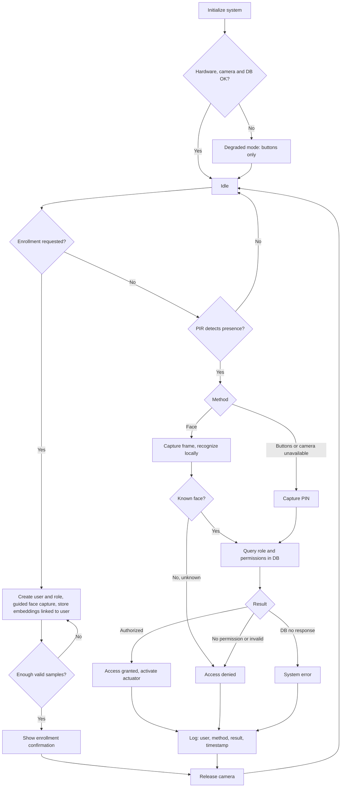

```mermaid
flowchart TD
    A[Initialize system] --> B{Hardware, camera and DB OK?}
    B -- No --> C[Degraded mode: buttons only]
    B -- Yes --> D[Idle]
    C --> D
    D --> M{Enrollment requested?}
    M -- Yes --> EN[Create user and role, guided face capture, store embeddings linked to user]
    EN --> V{Enough valid samples?}
    V -- No --> EN
    V -- Yes --> CF[Show enrollment confirmation]
    CF --> REL
    M -- No --> E{PIR detects presence?}
    E -- No --> D
    E -- Yes --> H{Method}
    H -- Face --> I[Capture frame, recognize locally]
    I --> K{Known face?}
    K -- No, unknown --> N
    K -- Yes --> Q
    H -- Buttons or camera unavailable --> BT[Capture PIN]
    BT --> Q[Query role and permissions in DB]
    Q --> S{Result}
    S -- Authorized --> OK[Access granted, activate actuator]
    S -- No permission or invalid --> N[Access denied]
    S -- DB no response --> ERR[System error]
    OK --> LOG
    N --> LOG
    ERR --> LOG[Log: user, method, result, timestamp]
    LOG --> REL[Release camera]
    REL --> D
```