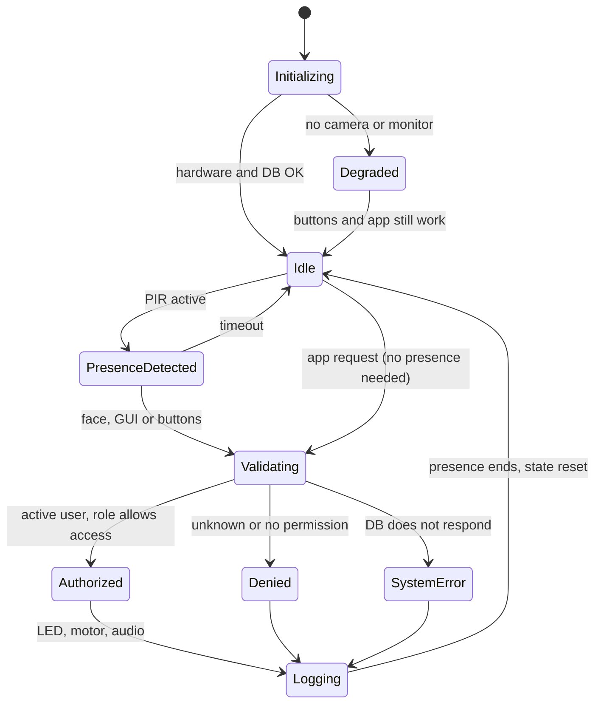
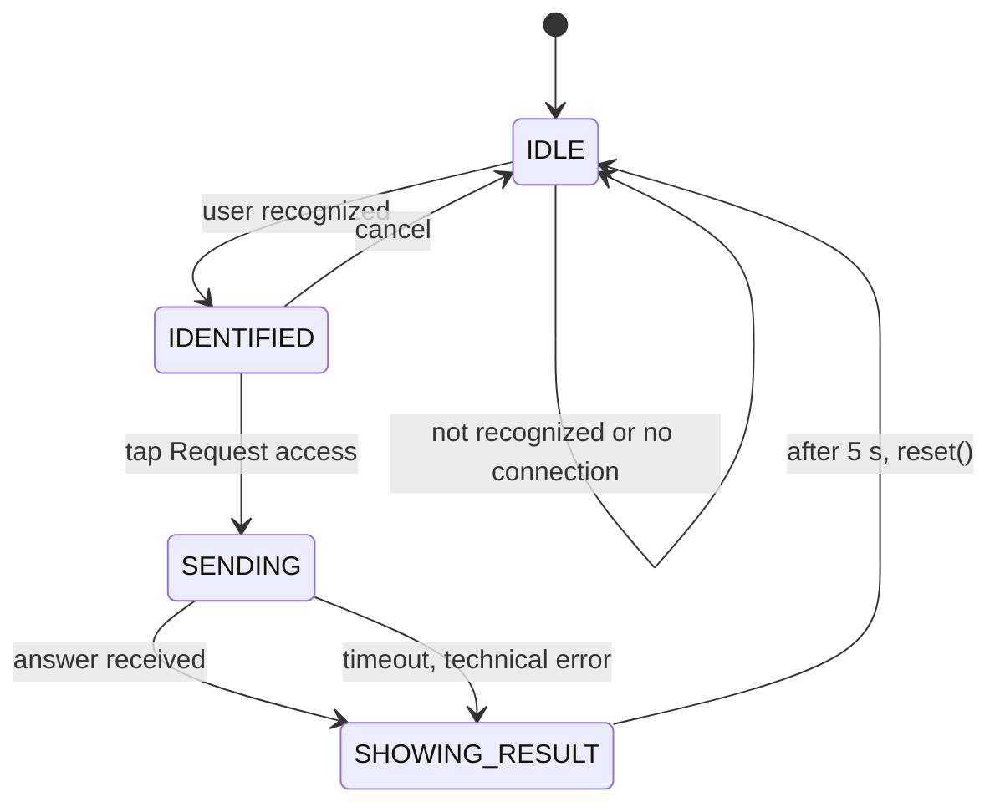

```mermaid
stateDiagram-v2
    [*] --> Initializing
    Initializing --> Idle: hardware and DB OK
    Initializing --> Degraded: no camera or monitor
    Degraded --> Idle: buttons and app still work

    Idle --> PresenceDetected: PIR active
    PresenceDetected --> Idle: timeout
    PresenceDetected --> Validating: face, GUI or buttons
    Idle --> Validating: app request (no presence needed)

    Validating --> Authorized: active user, role allows access
    Validating --> Denied: unknown or no permission
    Validating --> SystemError: DB does not respond

    Authorized --> Logging: LED, motor, audio
    Denied --> Logging
    SystemError --> Logging
    Logging --> Idle: presence ends, state reset
```

```mermaid
stateDiagram-v2
    [*] --> IDLE
    IDLE --> IDENTIFIED: user recognized
    IDLE --> IDLE: not recognized or no connection

    IDENTIFIED --> IDLE: cancel

    IDENTIFIED --> SENDING: tap Request access
    SENDING --> SHOWING_RESULT: answer received
    SENDING --> SHOWING_RESULT: timeout, technical error

    SHOWING_RESULT --> IDLE: after 5 s, reset()
```