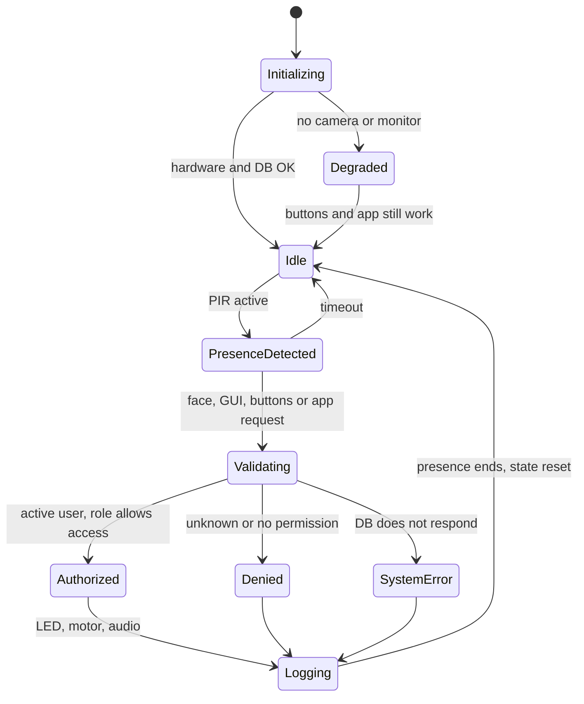
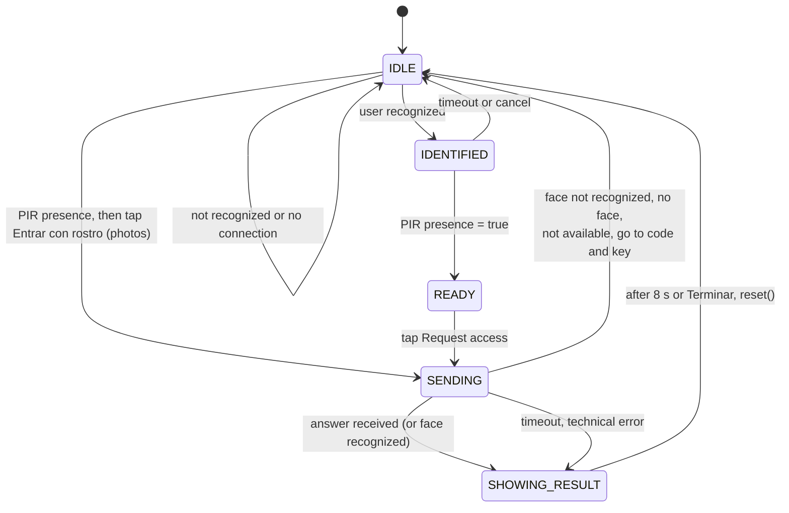

```mermaid
stateDiagram-v2
    [*] --> Initializing
    Initializing --> Idle: hardware and DB OK
    Initializing --> Degraded: no camera or monitor
    Degraded --> Idle: buttons and app still work

    Idle --> PresenceDetected: PIR active
    PresenceDetected --> Idle: timeout
    PresenceDetected --> Validating: face, GUI, buttons or app request

    Validating --> Authorized: active user, role allows access
    Validating --> Denied: unknown or no permission
    Validating --> SystemError: DB does not respond

    Authorized --> Logging: LED, motor, audio
    Denied --> Logging
    SystemError --> Logging
    Logging --> Idle: presence ends, state reset
```

```mermaid
stateDiagram-v2
    [*] --> IDLE
    IDLE --> SENDING: PIR presence, then tap Entrar con rostro (photos)
    SENDING --> IDLE: face not recognized, no face,<br/>not available, go to code and key
    IDLE --> IDENTIFIED: user recognized
    IDLE --> IDLE: not recognized or no connection

    IDENTIFIED --> READY: PIR presence = true
    IDENTIFIED --> IDLE: timeout or cancel

    READY --> SENDING: tap Request access
    SENDING --> SHOWING_RESULT: answer received (or face recognized)
    SENDING --> SHOWING_RESULT: timeout, technical error

    SHOWING_RESULT --> IDLE: after 8 s or Terminar, reset()
```