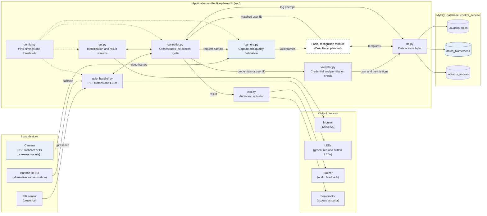

```mermaid
flowchart LR
    subgraph HW_IN["Input devices"]
        PIR["PIR sensor<br/>(presence)"]
        BTN["Buttons B1-B3<br/>(alternative authentication)"]
        CAM["Camera<br/>(USB webcam or Pi camera module)"]
    end

    subgraph HW_OUT["Output devices"]
        MON["Monitor<br/>(1280x720)"]
        LED["LEDs<br/>(green, red and button LEDs)"]
        BUZ["Buzzer<br/>(audio feedback)"]
        SERVO["Servomotor<br/>(access actuator)"]
    end

    subgraph APP["Application on the Raspberry Pi (src/)"]
        CTRL["controller.py<br/>Orchestrates the access cycle"]
        GPIO["gpio_handler.py<br/>PIR, buttons and LEDs"]
        GUI["gui.py<br/>Identification and result screens"]
        CAMM["camera.py<br/>Capture and quality validation"]
        FACE["Facial recognition module<br/>(DeepFace, planned)"]
        VAL["validator.py<br/>Credential and permission check"]
        OUT["exit.py<br/>Audio and actuator"]
        DB["db.py<br/>Data access layer"]
        CFG["config.py<br/>Pins, timings and thresholds"]
    end

    subgraph DATA["MySQL database: control_acceso"]
        T1[("usuarios, roles")]
        T2[("datos_biometricos")]
        T3[("intentos_acceso")]
    end

    PIR -->|"presence"| GPIO
    BTN -->|"fallback"| GPIO
    CAM -->|"video frames"| CAMM

    GPIO <--> CTRL
    GUI <--> CTRL
    CTRL -->|"request sample"| CAMM
    CAMM -->|"valid frames"| FACE
    FACE -->|"matched user ID"| CTRL
    CTRL -->|"credentials or user ID"| VAL
    VAL -->|"user and permissions"| DB
    FACE <-->|"templates"| DB
    CTRL -->|"log attempt"| DB
    CTRL -->|"result"| OUT

    GPIO --> LED
    GUI --> MON
    OUT --> BUZ
    OUT --> SERVO

    DB --> T1
    DB --> T2
    DB --> T3

    CFG -.-> CTRL
    CFG -.-> GPIO
    CFG -.-> GUI
    CFG -.-> CAMM

    classDef pi3 fill:#e8f1fb,stroke:#1f4e79,color:#111
    classDef planned fill:#ffffff,stroke:#1f4e79,stroke-dasharray:5 5,color:#111
    class CAM,CAMM,T2 pi3
    class FACE planned
```