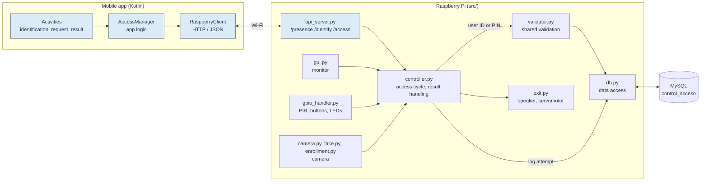

```mermaid
flowchart LR
    subgraph MOB["Mobile app (Kotlin)"]
        UI["Activities<br/>identification, request, result"]
        MGR["AccessManager<br/>app logic"]
        CLI["RaspberryClient<br/>HTTP / JSON"]
    end

    subgraph RPI["Raspberry Pi (src/)"]
        API["api_server.py<br/>/presence /identify /access"]
        GUI["gui.py<br/>monitor"]
        GPIO["gpio_handler.py<br/>PIR, buttons, LEDs"]
        FACE["camera.py, face.py, enrollment.py<br/>camera"]
        CTRL["controller.py<br/>access cycle, result handling"]
        VAL["validator.py<br/>shared validation"]
        OUT["exit.py<br/>speaker, servomotor"]
        DB["db.py<br/>data access"]
    end

    MYSQL[("MySQL<br/>control_acceso")]

    UI --> MGR --> CLI
    CLI <-->|"Wi-Fi"| API
    API --> CTRL
    GUI --> CTRL
    GPIO --> CTRL
    FACE --> CTRL
    CTRL -->|"user ID or PIN"| VAL
    CTRL --> OUT
    VAL --> DB
    CTRL -->|"log attempt"| DB
    DB <--> MYSQL

    classDef new fill:#DDEBF7,stroke:#1F4E79,color:#1F3864;
    class UI,MGR,CLI,API new;
```