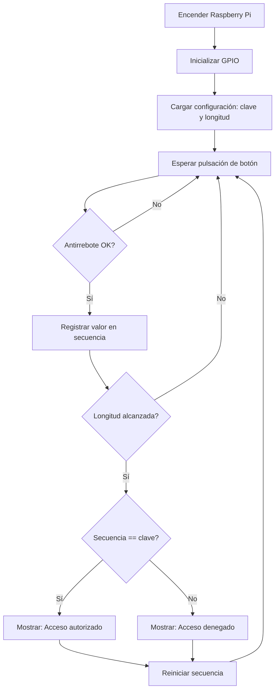

```mermaid
flowchart TD
    A[Encender Raspberry Pi] --> B[Inicializar GPIO]
    B --> C[Cargar configuración: clave y longitud]
    C --> D[Esperar pulsación de botón]
    D --> E{Antirrebote OK?}
    E -- No --> D
    E -- Sí --> F[Registrar valor en secuencia]
    F --> G{Longitud alcanzada?}
    G -- No --> D
    G -- Sí --> H{Secuencia == clave?}
    H -- Sí --> I[Mostrar: Acceso autorizado]
    H -- No --> J[Mostrar: Acceso denegado]
    I --> K[Reiniciar secuencia]
    J --> K
    K --> D
```