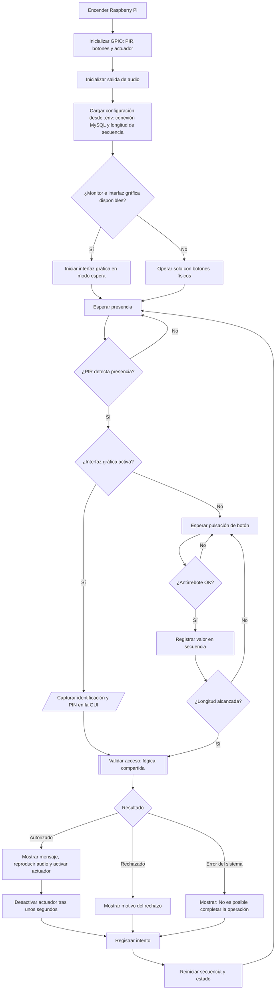

```mermaid
flowchart TD
    A[Encender Raspberry Pi] --> B[Inicializar GPIO: PIR, botones y actuador]
    B --> C[Inicializar salida de audio]
    C --> D[Cargar configuración desde .env: conexión MySQL y longitud de secuencia]
    D --> E{¿Monitor e interfaz gráfica disponibles?}
    E -- Sí --> F[Iniciar interfaz gráfica en modo espera]
    E -- No --> G[Operar solo con botones físicos]
    F --> H[Esperar presencia]
    G --> H

    H --> I{¿PIR detecta presencia?}
    I -- No --> H
    I -- Sí --> J{¿Interfaz gráfica activa?}

    J -- Sí --> K[/Capturar identificación y PIN en la GUI/]
    K --> V[[Validar acceso: lógica compartida]]

    J -- No --> L[Esperar pulsación de botón]
    L --> M{¿Antirrebote OK?}
    M -- No --> L
    M -- Sí --> N[Registrar valor en secuencia]
    N --> O{¿Longitud alcanzada?}
    O -- No --> L
    O -- Sí --> V

    V --> P{Resultado}
    P -- Autorizado --> Q[Mostrar mensaje, reproducir audio y activar actuador]
    Q --> R[Desactivar actuador tras unos segundos]
    P -- Rechazado --> S[Mostrar motivo del rechazo]
    P -- Error del sistema --> T[Mostrar: No es posible completar la operación]

    R --> U[Registrar intento]
    S --> U
    T --> U
    U --> W[Reiniciar secuencia y estado]
    W --> H
```