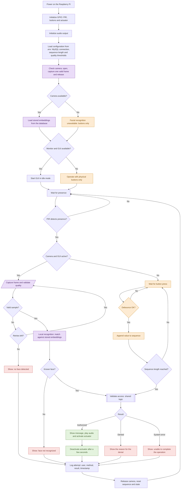

```mermaid
flowchart TD
    A[Power on the Raspberry Pi] --> B[Initialize GPIO: PIR, buttons and actuator]
    B --> C[Initialize audio output]
    C --> D[Load configuration from .env: MySQL connection, sequence length and quality thresholds]
    D --> E[Check camera: open, capture one valid frame and release]
    E --> F{Camera available?}
    F -- Yes --> G[Load stored embeddings from the database]
    F -- No --> H[Facial recognition unavailable: buttons only]
    G --> I{Monitor and GUI available?}
    H --> I
    I -- Yes --> J[Start GUI in idle mode]
    I -- No --> K[Operate with physical buttons only]
    J --> L[Wait for presence]
    K --> L

    L --> M{PIR detects presence?}
    M -- No --> L
    M -- Yes --> N{Camera and GUI active?}

    N -- Yes --> O[/Capture frame and validate quality/]
    O --> P{Valid sample?}
    P -- No --> Q{Retries left?}
    Q -- Yes --> O
    Q -- No --> X[Show: no face detected]
    P -- Yes --> R[Local recognition: match against stored embeddings]
    R --> S{Known face?}
    S -- No --> Y[Show: face not recognized]
    S -- Yes --> V[[Validate access: shared logic]]

    N -- No --> T[Wait for button press]
    T --> U{Debounce OK?}
    U -- No --> T
    U -- Yes --> W[Append value to sequence]
    W --> Z{Sequence length reached?}
    Z -- No --> T
    Z -- Yes --> V

    V --> AA{Result}
    AA -- Authorized --> AB[Show message, play audio and activate actuator]
    AB --> AC[Deactivate actuator after a few seconds]
    AA -- Denied --> AD[Show the reason for the denial]
    AA -- System error --> AE[Show: unable to complete the operation]

    AC --> LOG[Log attempt: user, method, result, timestamp]
    AD --> LOG
    AE --> LOG
    X --> LOG
    Y --> LOG
    LOG --> REL[Release camera, reset sequence and state]
    REL --> L

    classDef ok fill:#E4F3DE,stroke:#548235,color:#375623;
    classDef bad fill:#FBE2E1,stroke:#C0504D,color:#7A2E2C;
    classDef alt fill:#FDEBD3,stroke:#C87F0A,color:#7A4A05;
    classDef face fill:#EADCF8,stroke:#7030A0,color:#44205F;
    class AB,AC ok;
    class AD,AE,X,Y bad;
    class H,K,T,U,W alt;
    class E,G,O,R face;
```
