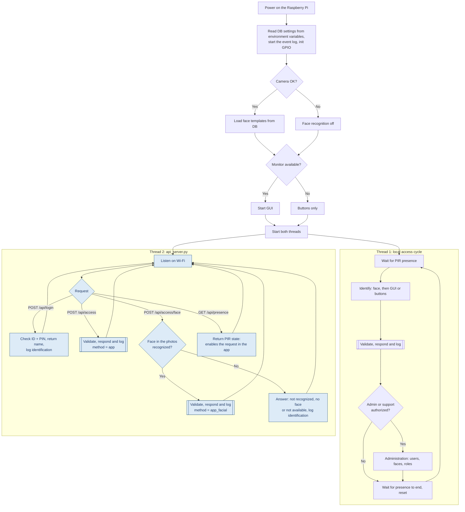

```mermaid
flowchart TD
    A[Power on the Raspberry Pi] --> B[Read DB settings from environment variables,<br/>start the event log, init GPIO]
    B --> C{Camera OK?}
    C -- Yes --> D[Load face templates from DB]
    C -- No --> E[Face recognition off]
    D & E --> F{Monitor available?}
    F -- Yes --> G[Start GUI]
    F -- No --> H[Buttons only]
    G & H --> T[Start both threads]

    T --> L1
    T --> A1

    subgraph MAIN["Thread 1: local access cycle"]
        L1[Wait for PIR presence] --> L2[Identify: face, then GUI or buttons]
        L2 --> L3[[Validate, respond and log]]
        L3 --> LA{Admin or support<br/>authorized?}
        LA -- Yes --> LM[Administration: users, faces, roles]
        LA -- No --> L4
        LM --> L4[Wait for presence to end, reset]
        L4 --> L1
    end

    subgraph API["Thread 2: api_server.py"]
        A1[Listen on Wi-Fi] --> A2{Request}
        A2 -- POST /api/login --> A4[Check ID + PIN, return name,<br/>log identification]
        A2 -- POST /api/access --> A7[[Validate, respond and log<br/>method = app]]
        A2 -- POST /api/access/face --> A5{Face in the photos<br/>recognized?}
        A5 -- Yes --> A8[[Validate, respond and log<br/>method = app_facial]]
        A5 -- No --> A6[Answer: not recognized, no face<br/>or not available, log identification]
        A2 -- GET /api/presence --> A3[Return PIR state:<br/>enables the request in the app]
        A3 & A4 & A6 & A7 & A8 --> A1
    end

    classDef app fill:#DDEBF7,stroke:#1F4E79,color:#1F3864;
    class A1,A2,A3,A4,A5,A6,A7,A8 app;
```
