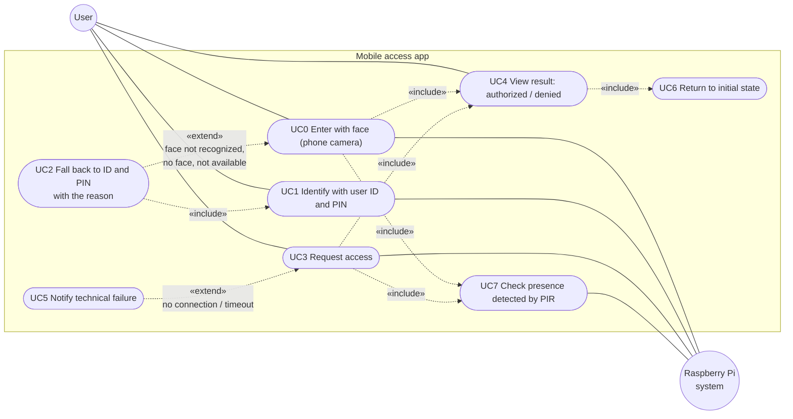

```mermaid
flowchart LR
    U(("User"))
    RPI(("Raspberry Pi<br/>system"))

    subgraph APP["Mobile access app"]
        UC0(["UC0 Enter with face (phone camera)"])
        UC1(["UC1 Identify with user ID and PIN"])
        UC2(["UC2 Fall back to ID and PIN<br/>with the reason"])
        UC3(["UC3 Request access"])
        UC4(["UC4 View result: authorized / denied"])
        UC5(["UC5 Notify technical failure"])
        UC6(["UC6 Return to initial state"])
        UC7(["UC7 Check presence detected by PIR"])
    end

    U --- UC0
    U --- UC1
    U --- UC3
    U --- UC4

    UC0 -.->|«include»| UC7
    UC3 -.->|«include»| UC7
    UC0 -.->|«include»| UC4
    UC2 -.->|«extend»<br/>face not recognized,<br/>no face, not available| UC0
    UC2 -.->|«include»| UC1
    UC3 -.->|«include»| UC4
    UC5 -.->|«extend»<br/>no connection / timeout| UC3
    UC4 -.->|«include»| UC6

    UC0 --- RPI
    UC1 --- RPI
    UC3 --- RPI
    UC7 --- RPI
```