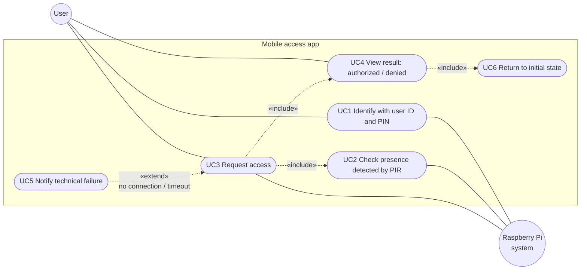

```mermaid
flowchart LR
    U(("User"))
    RPI(("Raspberry Pi<br/>system"))

    subgraph APP["Mobile access app"]
        UC1(["UC1 Identify with user ID and PIN"])
        UC2(["UC2 Check presence detected by PIR"])
        UC3(["UC3 Request access"])
        UC4(["UC4 View result: authorized / denied"])
        UC5(["UC5 Notify technical failure"])
        UC6(["UC6 Return to initial state"])
    end

    U --- UC1
    U --- UC3
    U --- UC4

    UC3 -.->|«include»| UC2
    UC3 -.->|«include»| UC4
    UC5 -.->|«extend»<br/>no connection / timeout| UC3
    UC4 -.->|«include»| UC6

    UC1 --- RPI
    UC2 --- RPI
    UC3 --- RPI
```